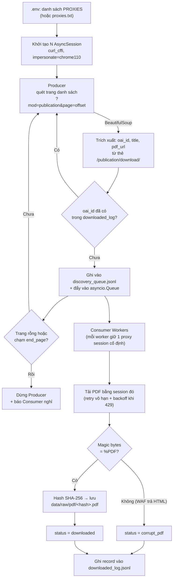

# Pipeline VISTA (Đang triển khai)

> Nguồn: `sti.vista.gov.vn`. Đây là pipeline **thu thập (discovery + download)** đang chạy thật, nằm ở `src/discovery/vista_crawler.py` + `scripts/run_crawler.py`.

## Vì sao chọn VISTA thay vì VJOL
VISTA lộ link tải PDF trực tiếp ngay trên trang danh sách (`<a href="/publication/download/...">`), nên không cần crawl qua trang chi tiết như VJOL. Đổi lại, VISTA có WAF chặn bot và giới hạn tốc độ gắt (cooldown ~15s/IP), nên phần lớn công sức hiện tại dồn vào việc "bypass WAF + né rate limit" hơn là parse dữ liệu.

## Sơ đồ luồng chảy

## Chi tiết từng bước

1. **Nạp proxy & tạo session** — Đọc danh sách proxy từ `.env` (biến `PROXIES`), mỗi proxy tạo một `curl_cffi.AsyncSession` giả lập TLS Chrome 110 để vượt WAF. Nếu không có proxy, chạy trực tiếp (rủi ro bị chặn cao hơn).
2. **Producer (Discovery)** — Lặp qua các trang `?mod=publication&page=<offset>` (offset += 20/trang), một proxy được chọn ngẫu nhiên chỉ để lật trang danh sách. Parse HTML bằng `BeautifulSoup`, lấy toàn bộ thẻ `<a>` chứa `/publication/download/` (link PDF) và tiêu đề tương ứng.
3. **Dedup & Resume** — Trước khi chạy, crawler đọc `downloaded_log.jsonl` để build tập `processed_ids`; mọi bài đã có status `downloaded` sẽ bị bỏ qua ngay ở bước trích xuất, giúp resume an toàn sau khi crash/dừng giữa chừng.
4. **Hàng đợi** — Metadata hợp lệ được ghi ngay vào `discovery_queue.jsonl` (persist trước khi tải, chống mất dữ liệu) và đẩy vào `asyncio.Queue` để Consumer xử lý song song với Producer.
5. **Điều kiện dừng quét** — Producer dừng khi đạt `end_page` (tham số dòng lệnh) hoặc khi một trang trả về **0 bài báo** (coi như đã quét hết danh sách).
6. **Consumer (Download)** — Số worker = `min(max_concurrent_requests, số proxy)`. Mỗi worker gán cố định 1 proxy session (không đổi trong suốt phiên) để giữ WAF "quen mặt" IP đó. Trước khi tải, sleep jitter nhỏ (0.1–0.3s) để tránh spam.
7. **Retry/Backoff khi bị chặn** — Gặp lỗi (đặc biệt HTTP 429), worker **retry vô hạn**: backoff tăng dần theo cấp số nhân với lỗi thường, hoặc `15s × số lần thử` (tối đa 60s) riêng cho lỗi 429.
8. **Kiểm tra & lưu file** — Kiểm tra magic bytes `%PDF` để loại các trang HTML lỗi (do bị WAF chặn nhưng trả về HTTP 200). File hợp lệ được băm SHA-256 và lưu vào `data/raw/pdf/<hash>.pdf` (tự động loại trùng nội dung).
9. **Ghi log kết quả** — Mỗi bài xử lý xong (`downloaded`, `corrupt_pdf`, hoặc `download_failed`) được append vào `downloaded_log.jsonl` — đây là nguồn sự thật duy nhất để biết bài nào đã xong.

## Đang thử nghiệm (chưa merge vào pipeline chính)
Các script trong `scripts/` (`benchmark_5_policies.py`, `test_stateful_proxy.py`, `generate_sticky_proxies.py`, `test_rotating_proxy_vista.py`, `test_optimized_rotating_crawler.py`) là các thử nghiệm tìm cấu hình tối ưu (số worker, sleep/backoff, cách xoay proxy). Kết luận hiện tại: bỏ Rotating Gateway (chọn proxy ngẫu nhiên gây 429 nhiều), chuyển sang **`StatefulProxyManager`** — theo dõi `last_used_time` từng IP tĩnh trong `proxies.txt`, chỉ cấp phát IP đã nghỉ đủ 15s cooldown. Thiết kế này **chưa được đưa vào** `src/discovery/vista_crawler.py`; đây là bản kế tiếp dự kiến thay thế cơ chế chọn proxy ngẫu nhiên hiện tại. Chi tiết số liệu benchmark xem `CONTEXT.md`.

## Chưa triển khai (nằm ngoài phạm vi crawler hiện tại)
Pipeline hiện tại **dừng ở bước tải PDF thô**. Các bước xử lý sâu hơn — Triage/Parse PDF (PyMuPDF/Marker OCR trên GPU A100), Normalize, Structure Extraction, Quality Scoring, Dedup, Rights Gate, Packaging, Visualization — vẫn chỉ tồn tại ở dạng thiết kế mục tiêu, xem `docs/IMPLEMENTATION_PLAN.md`.
