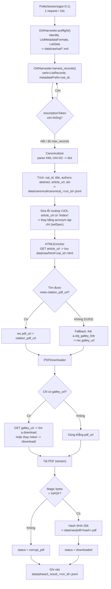

# Pipeline VJOL (Đã lưu trữ / không còn phát triển)

> Nguồn: `vjol.info.vn` (Vietnam Journals Online, nền OJS). Đây là hướng triển khai **đầu tiên** của dự án, chạy thử thành công 1 lần (20 bài, 2026-08-17) rồi bị **pivot sang VISTA** ngày hôm sau. Code gốc nằm ở package `paper_etl/` — package này **không còn trong cây thư mục hiện tại**, chỉ còn lưu trong lịch sử git (commit `c95121c`). Tài liệu này mô tả lại đúng những gì code đó đã làm, để tham khảo nếu sau này quay lại nguồn VJOL.

## Vì sao dừng VJOL
VJOL ổn định hơn VISTA (100% thành công, ~7.5 req/phút, không bị 429), nhưng lấy được file PDF cần đi qua **3 chặng**: harvest metadata qua OAI-PMH → vào trang HTML chi tiết bài báo để tìm link PDF → nhiều trường hợp phải vào tiếp trang "galley viewer" mới ra được link tải thật. VISTA cho phép bỏ qua 2 chặng sau vì link PDF đã lộ sẵn ở trang danh sách, nên dự án chuyển hướng để tối ưu tốc độ thu thập số lượng lớn.

## Sơ đồ luồng chảy (`main.py` → 4 module trong `paper_etl/`)

## Chi tiết từng bước

1. **`PoliteSession`** — Session dùng chung, giới hạn `qps=0.1` (1 request/10 giây) để tôn trọng `robots.txt` của VJOL. Không có TLS spoofing hay proxy — không cần vì VJOL không chặn bot gắt như VISTA.
2. **`OAIHarvester.preflight()`** — Gọi 3 verb chuẩn OAI-PMH (`Identify`, `ListMetadataFormats`, `ListSets`) để xác thực endpoint sống và biết định dạng metadata hỗ trợ, lưu XML thô vào `data/raw/oai/`.
3. **`OAIHarvester.harvest_records()`** — Gọi `ListRecords` với `metadataPrefix=oai_dc`, lặp theo `resumptionToken` cho đến khi hết trang hoặc đạt `max_records`. Mỗi trang XML được lưu vào `data/raw/oai/runs/<run_id>/page-NNNNNN.xml`.
4. **`Canonicalizer`** — Parse XML OAI-DC bằng `lxml`, trích các trường Dublin Core (`dc:title`, `dc:creator`, `dc:description`, `dc:identifier`) thành JSON phẳng, ghi vào `data/canonical/canonical_<run_id>.jsonl`. Có xử lý riêng một lỗi routing thực tế của VJOL: URL bài báo trong metadata đôi khi trỏ về `/index/` (route rỗng) thay vì route đúng của tạp chí — được vá bằng cách thay `/index/` bằng acronym tạp chí lấy từ `setSpec`.
5. **`HTMLEnricher`** — Tải trang chi tiết bài báo (`article_url`), lưu HTML thô vào `data/raw/html/`, rồi tìm thẻ `<meta name="citation_pdf_url">`. Nếu không có (một số tạp chí chạy OJS3 không nhúng meta này), fallback sang tìm link `<a class="obj_galley_link">` — đây chỉ là link đến trang xem trước (galley viewer), chưa phải link PDF thật.
6. **`PDFDownloader`** — Nếu chỉ có `galley_url`, phải tải thêm trang galley viewer đó để tìm `<a class="download">`; nếu không thấy, dùng mẹo thay `/view/` bằng `/download/` trong URL. Sau khi có link PDF thật, tải bằng `stream=True`, kiểm tra magic bytes `%PDF`, băm SHA-256, lưu vào `data/raw/pdf/<hash>.pdf`.
7. **Kết quả** — Toàn bộ record (kèm `status`: `downloaded` / `corrupt_pdf` / `download_error` / `missing_pdf_url`) được ghi vào `data/phase2_result_<run_id>.jsonl`.

## Tình trạng
Chạy thử thành công với 20 bài (xem commit `c95121c`, dữ liệu mẫu vẫn còn trong lịch sử git ở `data/raw/oai/`, `data/raw/html/`, `data/canonical/`). Sau đó dự án pivot sang VISTA (commit `e8e7291`) và package `paper_etl/` bị thay thế hoàn toàn bởi `src/`. **Không có kế hoạch tiếp tục VJOL** trừ khi có quyết định quay lại nguồn này — nếu quay lại, cấu trúc 3 chặng (OAI → HTML detail → galley) và bản vá routing ở bước Canonicalizer vẫn còn giá trị tham khảo.
